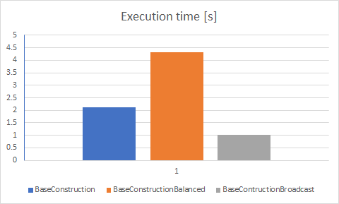

# Report - Project 2 - Advanced DB Systems

Author : Bastien Wermeille
Sciper : 308542
Date : 06.05.2021

## 8 - Performance evaluation
As asked during the exercice session if I needed to run the test for every corpus or if I could only run it for corpus 10 and it was told to me that it was ok to simply use corpus 10. I simply ran my test with a single corpus set `10` and query set `10-2` which gave me the following results:
- `ExactNN` : NaN
- `BaseConstruction` : 1.26
- `BaseConstructionBalanced` : 1.88
- `BaseConstructionBroadcast` : 0.84

Regarding the ExactNN, I tried to run it but it never ended so I stopped it after a few minutes.

Here is the graph of the resulting graph for the query :

Regarding the average distance of each query point from each nearest neighbours, I calculated it with multiple threshold and here are the results. The threshold are on the bottom and resulting average on the left.

As we can see, we can get very good results with a resonable threshold of 0.55, this is enough with a precision of 0.97 for this value.
It's therefore beneficial to use an approximation instead of exact to have some strong results which could offer more realistic data.
